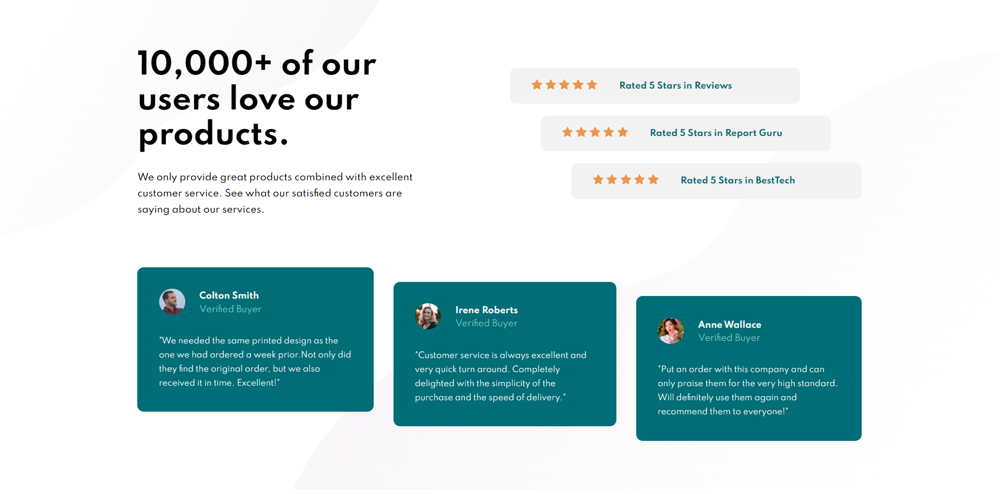

# Social Proof Section

> Live demo [https://jakubparlej.github.io/social-proof-section/](https://jakubparlej.github.io/social-proof-section/).

## Table of Contents

- [General info](#general-info)
- [Technologies](#technologies)

## General info

Challenge was to build out this social proof section and get it looking as close to the design as possible.

## Technologies

Project is created with:

- HTML
- CSS

## Acknowledgements

This is the challenge from [frontendmentor.io](https://www.frontendmentor.io/challenges/social-proof-section-6e0qTv_bA)

## Contact

Created by [@jakubparlej](https://jprojects.pl) - feel free to contact me!
